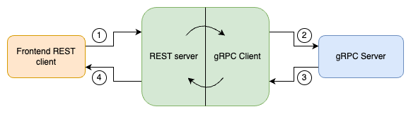

# Mini gRPC Gateway

Source code for my article: [Protoc Plugins in Go: gRPC-REST Gateway from Scratch](https://itnext.io/protoc-plugins-in-go-grpc-rest-gateway-from-scratch-0b9fcc7513e1)

gRPC-REST gateway is one of the most popular projects in the gRPC-Ecosystem. Since I really like to understand how things work under the hood and how they are implemented, I decided to try and build a minimal gRPC-REST Gateway from scratch. If you are interested as well, make sure to read through the article as I’ve learned a bunch while trying to code it up.



## How to run:
- Make sure to have `Go` and `Protoc` installed.
```bash
make generate-backend
make generate
make backend
```
In a new terminal, run:
```bash
make run
```
Try it out with a simple curl:
```bash
curl localhost:8000/api/posts
```
